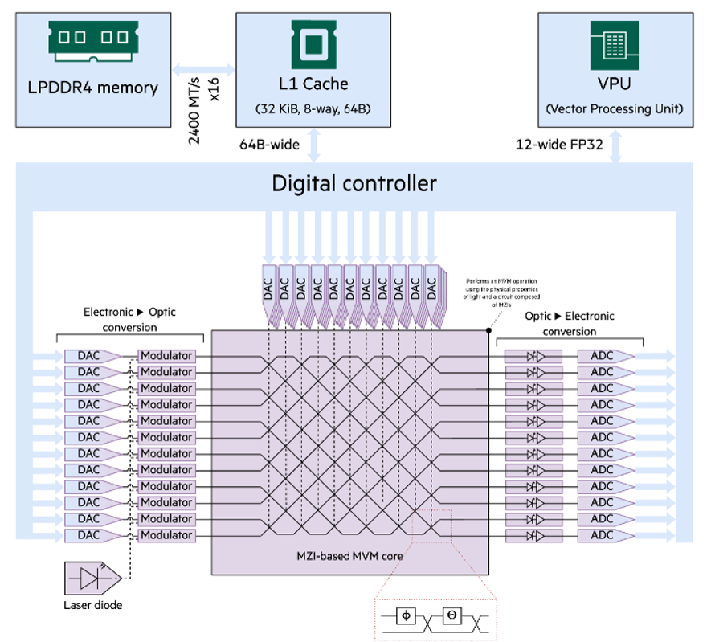

# BYOD tutorials

## [Tutorial 1](./1_Photonic_Tensor_Core/) - Simulating an analog photonic accelerator system for performing matrix-vector multiplications
<figure>

<figcaption> Figure caption </figcaption>
</figure>

Meshes of optical waveguides can be used to perform unitary matrix operations on a set of optical modes. Photonic tensor cores are analog computing systems that aim to exploit this for accelerating the computation of linear algebra operations in various use cases. This tutorial shows how to create a simple photonic tensor core based on Clements meshes in BYOD. The [example notebook](./1_Photonic_Tensor_Core/Photonic_Tensor_Core_Tutorial.ipynb) shows how to generate an SST configuration file that assembles the photonic system and connects it to a DDR4 memory system simulated with [DRAMsim3](https://github.com/umd-memsys/DRAMsim3). Using the configuration file, SST performs an end-to-end simulation of loading data from memory, performing a set of subsequent matrix-vector computations and storing the results back in memory. The simulation outputs the system's throughout and energy consumption.

